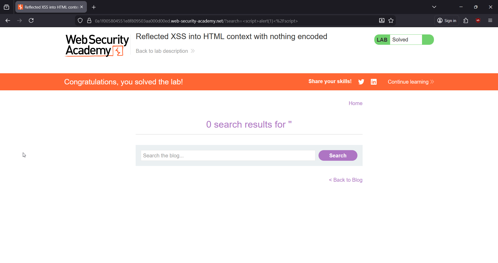
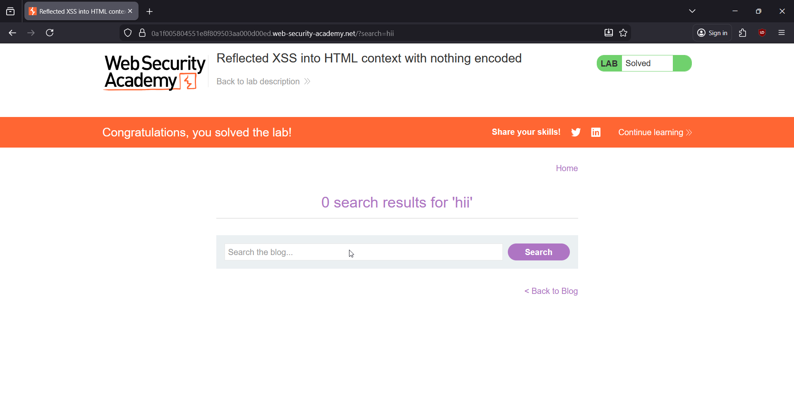
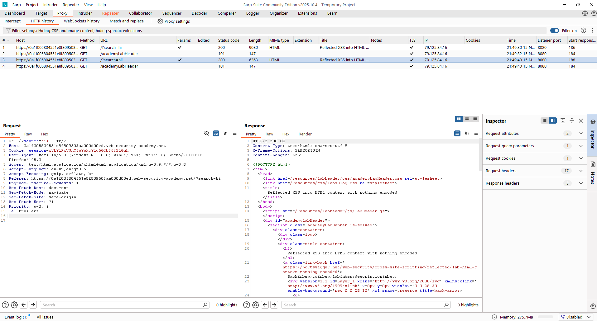
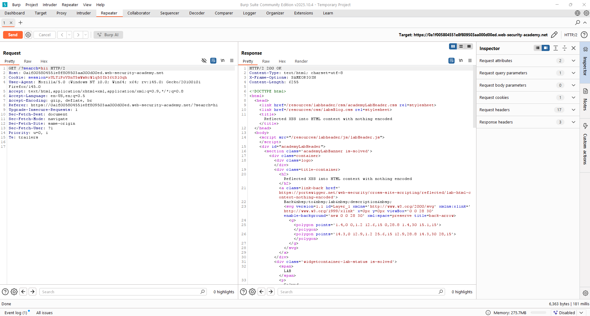
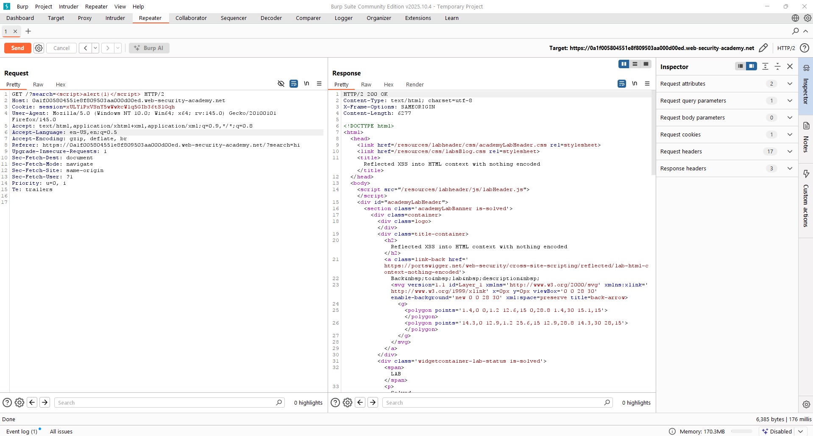
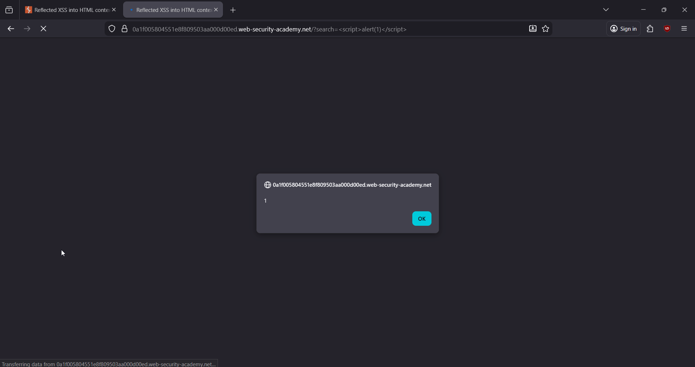
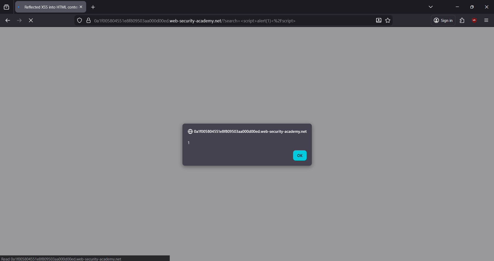

# 🎯 Reflected Cross-Site Scripting: HTML Context (Nothing Encoded)

**Write-Up by Aditya Bhatt | Reflected XSS | HTML Injection | BurpSuite**

This PortSwigger lab contains a **simple reflected XSS vulnerability** inside the search functionality.
Since **nothing is encoded**, our input is injected directly into the HTML response — letting us run arbitrary JavaScript.

We’ll craft a script payload, verify its reflection using BurpSuite, then execute it to solve the lab.


---

# 🧪 TL;DR

* Search parameter is fully reflected in **HTML context**
* No sanitization → no filtering → no encoding
* `<script>` tags execute normally
* Final payload:

```
<script>alert(1)</script>
```

* Load the response in browser → **Alert pops** → Lab Solved 🎉

---

# 🌐 Brief Intro

Reflected XSS occurs when user input is returned immediately in a server response **without any output encoding**.
Because this lab uses pure HTML context, a `<script>` tag is interpreted as real JavaScript — not text. Perfect playground for classic XSS.

We’ll go step-by-step using BurpSuite to observe how our payload behaves inside the HTML page.

---

# 🧬 Step-By-Step PoC (Screenshots Included)

## **1. Open the Lab with FoxyProxy enabled (Burp Intercept ON)**

We start by loading the lab with Burp intercepting the traffic to capture every request.



➤ **Why?**
To observe how the search parameter is transmitted and understand the baseline request.

---

## **2. Perform a normal search like hii and capture the request**

This helps us see exactly where user-controlled input appears in the application response.



➤ **Why?**
A benign input verifies reflection behaviour and gives us the injection point.

---

## **3. Send the request to Repeater (Ctrl + R)**

We move the captured request to Repeater for precise testing.



➤ **Why?**
Repeater allows us to modify parameters safely and instantly reissue requests.

---

## **4. Send the request inside Repeater**

We send the baseline request to confirm how the server normally handles the input.



➤ **Why?**
This helps verify search input is reflected directly in the HTML source — no encoding detected.

---

## **5. Inject the XSS payload into the search parameter**

We now replace the search value after `GET /?search=` with the script payload:

```
<script>alert(1)</script>
```



➤ **Why?**
This script runs because the server reflects it *as-is*, and the browser executes it during page rendering.

---

## **6. Open the modified request in the browser**

Using “Open in Browser,” we render the response exactly how the user would see it.



➤ **Why?**
This step forces the browser to interpret (and execute) our injected `<script>` element.

---

## **7. Success — alert pops! Lab Solved 🎉**

The JavaScript executes, confirming that the XSS attack is successful and the lab is completed.



---

# 🧠 Key Takeaways

* HTML context with no encoding is the **most dangerous** and easiest place for XSS.
* `<script>` payloads work immediately because they break out of HTML and execute.
* BurpSuite Repeater is perfect for verifying reflection points before execution.
* Always validate where input lands: HTML, attribute, JS context, URL — each behaves differently.

---

# 🔥 Final Thoughts

This lab demonstrates an essential XSS concept:
If user input is placed inside an HTML page without encoding, **your browser becomes an execution engine**.

Simple, clean, and classic — but extremely powerful in real-world VAPT engagements.

Stay sharp. Stay offensive. <br/>
— **Aditya Bhatt** 🔥

---
